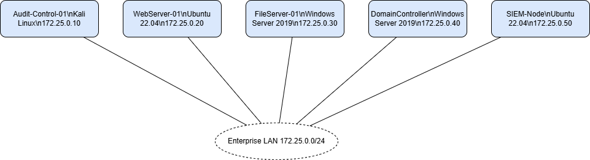
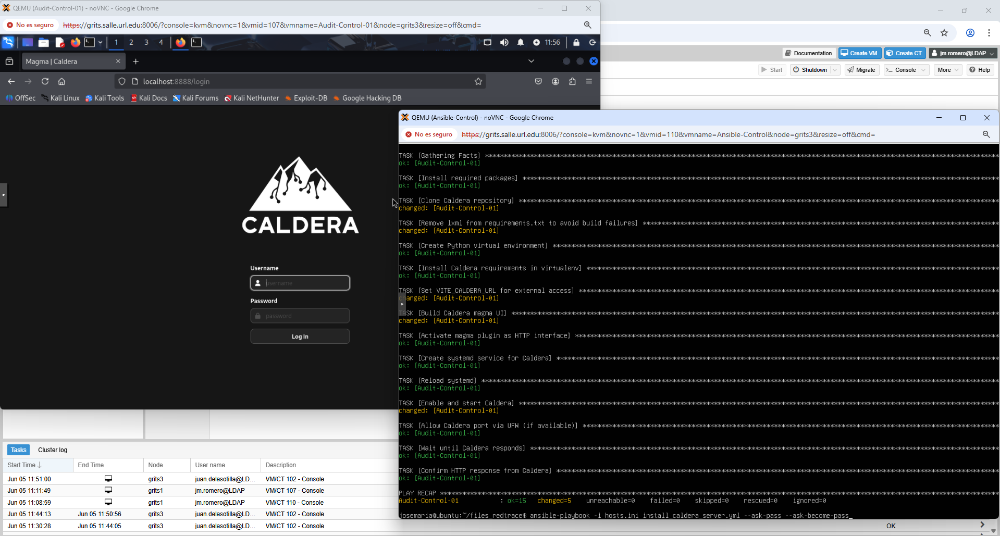

# Operation RedTrace

This repository contains Ansible playbooks and PowerShell scripts for Operation RedTrace. The scenario files reside in `scenarios/operation-redtrace/` and include the topology for a training lab where the Red Team uses **MITRE Caldera** while the Blue Team defends with **Wazuh**. [Operation RedTrace - KYPO Edition v0.77](Operation%20RedTrace%20-%20KYPO%20Edition%20v0.77.docx) includes full step‑by‑step instructions, and [`docs/exercises.md`](docs/exercises.md) provides suggested training exercises.



## Requirements

Ensure Ansible is installed on the control machine. Install the required collections with:

```bash
ansible-galaxy collection install -r requirements.yml
```

## Preparing the environment

1. Import the necessary base ISOs (Kali Linux, Ubuntu 22.04, Windows Server 2019, etc.) and create the `vmbr1` bridge on the `172.25.0.0/24` network.
2. Create the virtual machines defined in `scenarios/operation-redtrace/topology.yaml` and assign the following IP addresses:
   - `Audit-Control-01` – 172.25.0.10
   - `WebServer-01` – 172.25.0.20
   - `FileServer-01` – 172.25.0.30
   - `DomainController` – 172.25.0.40
   - `SIEM-Node` – 172.25.0.50

## Preparing the control machine

Create the control machine and assign the following IP address:   
   - `Ansible-Control` – 172.25.0.60

Install Ansible that can reach all VMs. Copy the files from `inventory/` to `/etc/ansible/hosts` or supply them with `-i` when running playbooks.

## Playbook and script execution order

The following image shows this working environment.



```bash
ansible-playbook -i scenarios/operation-redtrace/inventory/hosts_ip.ini scenarios/operation-redtrace/playbooks/set_static_ip_linux_netplan.yml ... --ask-pass --ask-become-pass
ansible-playbook -i scenarios/operation-redtrace/inventory/hosts_ip.ini scenarios/operation-redtrace/playbooks/set_static_ip_linux_nmcli.yml ... --ask-pass --ask-become-pass
ansible-playbook -i scenarios/operation-redtrace/inventory/hosts.ini scenarios/operation-redtrace/playbooks/set_static_ip_windows.yml ...
ansible-playbook -i scenarios/operation-redtrace/inventory/hosts.ini scenarios/operation-redtrace/playbooks/install_caldera_server.yml ... --ask-pass --ask-become-pass
ansible-playbook -i scenarios/operation-redtrace/inventory/hosts.ini scenarios/operation-redtrace/playbooks/install_wazuh_manager.yml ... --ask-pass --ask-become-pass
$env:ADMIN_PASSWORD="<YourPassword>"
.\promote.ps1
.\domain.ps1
.\windows_server_setup.ps1
ansible-playbook -i scenarios/operation-redtrace/inventory/hosts.ini scenarios/operation-redtrace/playbooks/install_wazuh_agent_linux.yml ... --ask-pass --ask-become-pass
.\install_wazuh_agent_windows.ps1
Ensure the $env:ADMIN_PASSWORD variable is set before running the PowerShell scripts.
```

After the domain controller and file server are configured, run the
PowerShell scripts `generate_winrm_cert_dc1.ps1` and
`generate_winrm_cert_fs1.ps1` on their respective hosts to enable WinRM
over HTTPS.

Running the playbooks and scripts in this order configures network settings, promotes the domain controller, joins the file server to the domain, installs the Caldera server, deploys the Wazuh manager, and installs Wazuh agents on both Linux and Windows hosts.

##	References

All URL links are available as of 20 June 2025.

Ansible. (2025, 20 June). Documentation.  
https://docs.ansible.com  
Draw.io. (2025, 20 June). Security-first diagramming for teams.  
https://www.drawio.com  
MITRE Caldera. (2025, 20 June). A Scalable, Automated Adversary Emulation Platform.  
https://caldera.mitre.org  
PowerShell. (2025, 20 June). What is PowerShell? Microsoft.  
https://learn.microsoft.com/es-es/powershell/scripting/overview?view=powershell-7.5  
Proxmox VE. (2025, 20 June). Administration Guide. Release 8.4.0. 636 pages.  
https://pve.proxmox.com/pve-docs/pve-admin-guide.pdf  
Wazuh. (2025, 20 June). The Open Source Security Platform.  
https://wazuh.com  

## Licence

This project is provided for educational purposes.
